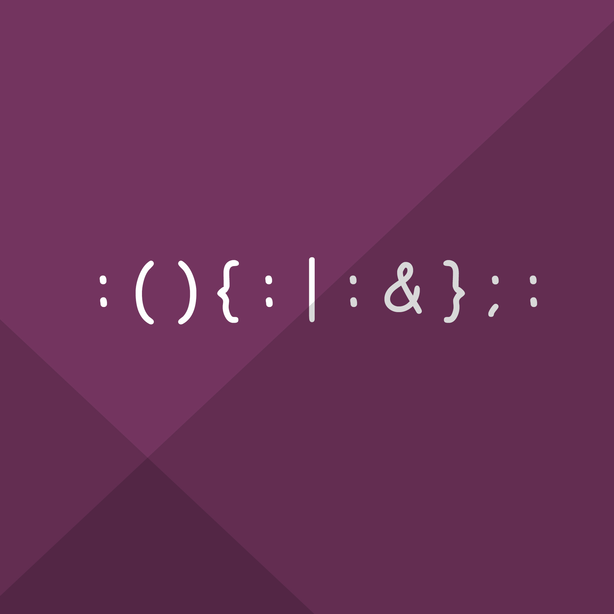

<!-- Main -->

<!-- One -->
<section id="one">
	

		<header class="major">
			<h2>Profile</h2>
		</header>
		
I am currently working as a Security Analyst ( SOC ) at Threat Stack, Boston. I have completed a degree in Master of Science in Information Assurance and Cybersecurity from Northeastern University, Boston and a Bachelor of Technology in Information Technology from the Vellore Institute of technology, India. To known more about my background, I would encourage going through my <a href="https://skyseccoder.github.io/assets/docs/Resume.pdf">resume</a>

	

</section>

<!-- Two -->
<section id="two" class="spotlights">
	<section>
		
		

			

				<header class="major">
					<h3>Education</h3>
				</header>
				
<b>NORTHEASTERN UNIVERSITY</b>, Boston, MA  College of Computer and Information Science, Candidate for a Master of Science in Information Assurance and Cybersecurity
				 
				 <b>VELLORE INSTITUTE OF TECHNOLOGY</b>, Tamil Nadu, India  School of Information Technology and Engineering,  Bachelor of Technology in Information Technology
				

				<ul class="actions">
					<!--li><a href="generic.html" class="button">Learn more</a></li-->
				</ul>
			

		

	</section>
	<section>
		
		

			

				<header class="major">
					<h3>Skills</h3>
				</header>
				
<b>Language:</b>C, C++, JavaScript (Node JS), HTML, Swift, Python, Bash 
				  <b>Operating System:</b>Mac OS, Windows 7-10, Kali Linux, CentOS, Ubuntu 
				  <b>Tools:</b>Wireshark, FileZilla, NetWitness Investigator, Aircrack-ng, OpenVAS,
				  DefectDojo, OWASP ZAP Splunk, Suricata, Metasploit, FTK Imager, ProDiscover, 
				 SANS SIFT, Sleuth Kit, Autopsy, Xplico, VMware Workstation, Nessus, Burp Suite, 
				 JIRA, SIEM, Threat Stack 
				  <b>Cloud technologies:</b>AWS( Amazon Web Services ), Terraform, Docker, Kubernetes

				<ul class="actions">
					<!--li><a href="generic.html" class="button">Learn more</a></li-->
				</ul>
			

		

	</section>
	<section>
		
		

			

				<header class="major">
					<h3>Projects</h3>
				</header>
				
<b>Technical paper</b>
						 • "Implementing the Bell LaPadula model using homomorphic encryption”, which provides more security to company data by using RSA encryption and access control lists.
					  <b>Web Application attacks</b> 
						 • Discovered several security issues in WebGoat, Gruyere and DVWA and conducted several attacks using various attack vectors in order to better understand web application attacks.
					  <b>Denial of service payloads</b> 
						 • Created several Botnets and Denial of Service attacks in order to help system administrators and ethical penetrations testers to conduct attacks.
				

				<ul class="actions">
					<!--li><a href="generic.html" class="button">Learn more</a></li-->
				</ul>
			

		

	</section>
</section>

<!-- Three >
<section id="three">
	

		<header class="major">
			<h2>Massa libero</h2>
		</header>
		
Nullam et orci eu lorem consequat tincidunt vivamus et sagittis libero. Mauris aliquet magna magna sed nunc rhoncus pharetra. Pellentesque condimentum sem. In efficitur ligula tate urna. Maecenas laoreet massa vel lacinia pellentesque lorem ipsum dolor. Nullam et orci eu lorem consequat tincidunt. Vivamus et sagittis libero. Mauris aliquet magna magna sed nunc rhoncus amet pharetra et feugiat tempus.

		<ul class="actions">
			<!-li><a href="generic.html" class="button next">Get Started</a></li->
		</ul>
	

</section-->

